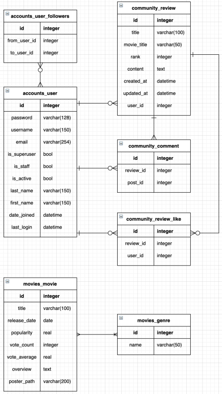

# pjt 09 - 알고리즘을 적한 서버 구성


## 1. 목표

- 데이터를 생성, 조회, 수정, 삭제할 수 있는 Web Application 제작
- AJAX 통신과 JSON 구조에 대한 이해
- Database 1:N, M:N 관계의 이해와 데이터 관계 설정
- 추천 알고리즘 작성


## 2. 준비사항

1. 언어
   1. Python 3.8+
   2. Django 3.X
2. 도구
   1. vsCode
   2. Chrome Browser


## 3. 요구사항 및 구현

> 커뮤니티 서비스의 상세 기능 개발을 위한 단계로, 모델간의 관계 설정 후 AJAX 통신을 활용하여 UI/UX를 개선합니다.


### A. 프로젝트 구조

- pjt09/은 startproject 명령어로 생성되는 project 디렉토리

- community/는 startapp 명령어로 생성되는 application 디렉토리

- 아래의 폴더구조는 주요한 폴더와 파일만 명시되어 있음

- ```
  pjt09/
  	settings.py
  	urls.py
  accounts/
  	migrations/
  	templates/
  	froms.py
  	models.py
  	urls.py
  	views.py
  community/
  	migrations/
  	templates/
  	forms.py
  	models.py
  	urls.py
  	views.py
  templates/
  	base.html
  manage.py
  ...
  ```


### B. Model




### C. URL

1. community app

   - community app의 모든 URL 패턴은 community/로 시작

   | HTTP verb  | URL 패턴                      | 설명                        |
   | ---------- | ----------------------------- | --------------------------- |
   | GET & POST | reviews/create/               | Form 표시 및 신규 리뷰 생성 |
   | GET        | reviews/                      | 전체 리뷰 목록 조회 페이지  |
   | GET        | reviews/<review_pk>/          | 단일 리뷰 상세 조회 페이지  |
   | POST       | reviews/<review_pk>/comments/ | 댓글 생성                   |
   | POST       | reviews/<review_pk>/like/     | 좋아요 기능                 |

2. accounts app

   - accounts app의 모든 URL 패턴은 accounts/로 시작

   | HTTP verb  | URL 패턴          | 설명                                    |
   | ---------- | ----------------- | --------------------------------------- |
   | GET & POST | signup/           | Form 표시 및 신규 사용자 생성(회원가입) |
   | GET & POST | login/            | Form 표시 및 기존 사용자 인증(로그인)   |
   | GET / POST | logout/           | 인증된 사용자 인증 해제(로그아웃)       |
   | GET        | \<str:username\>/ | 사용자 상세 조회 페이지                 |
   | GET / POST | follow/<user_pk>/ | 팔로우 추가 / 팔로우 취소               |

3. movies app

   - moviews app의 모든 URL 패턴은 movies/로 시작

   | HTTP verb | URL 패턴     | 설명                       |
   | --------- | ------------ | -------------------------- |
   | GET       | /            | 전체 영화 목록 조회 페이지 |
   | GET       | <movie_pk>/  | 단일 영화 상세 조회 페이지 |
   | GET       | recommended/ | 추천 영화 조회 페이지      |

   

### D. View & Template

1. 리뷰 좋아요 기능
   - 리뷰 조회 페이지에 각 리뷰의 좋아요 버튼과 좋아요 개수를 출력합니다.
   - 이미 좋아요 버튼을 누른 경우 취소 버튼을 출력합니다.
   - 인증된 사용자만 리뷰에 좋아요 할 수 있습니다.
   - 좋아요 버튼을 클릭하는 경우 AJAX통신을 이용하여 서버에서 JSON데이터를 받아와 상황에 맞게 HTML화면을 구성합니다.

```django
<!-- community/index.html -->



	<!-- ... 생략	-->
  
	<!-- ... 생략 -->
    <form class="d-inline like-form" data-review-id="{{ review.pk }}">
      
      
        <button class="btn btn-link" id="like-{{ review.pk }}">
          <i class="fas fa-heart fa-lg" style="color:crimson;"></i>
        </button>
      
        <button class="btn btn-link" id="like-{{ review.pk }}">
          <i class="fas fa-heart fa-lg" style="color:black;"></i>
        </button>
      
    </form>
    <span id="like-count-{{ review.pk }}">{{ review.like_users.all|length }}</span> 명이 이 글을 좋아합니다.
    <a href="">[detail]</a>
    <hr>
  

  <script>
    const forms = document.querySelectorAll('.like-form')
    const csrftoken = document.querySelector('[name=csrfmiddlewaretoken]').value
    
    forms.forEach(form => {
        form.addEventListener('submit', event => {
            event.preventDefault()
            const { reviewId } = event.target.dataset
            axios({
                method: 'post',
                url: `http://127.0.0.1:8000/community/${reviewId}/like/`,
                headers: {'X-CSRFToken': csrftoken}
            })
            .then(response => {
                const { liked, cnt_like } = response.data
                const likeButton = document.querySelector(`#like-${reviewId} > i`)
                const likeCount = document.querySelector(`#like-count-${reviewId}`)
                likeCount.innerText = cnt_like
                if (liked) {
                    likeButton.setAttribute("style", "color:crimson")
                } else {
                    likeButton.setAttribute("style", "color:black")
                }
            })
            .catch(error => {
              if (error.response.status === 401) {
                window.location.href = '/accounts/login/'
              }
            })
        })
    })
  </script>

```

```python
# community/views.py
from django.views.decorators.http import require_POST
from django.shortcuts import get_object_or_404
from .models import Review
from django.http import JsonResponse, HttpResponse

@require_POST
def like(request, review_pk):
    if request.user.is_authenticated:
        review = get_object_or_404(Review, pk=review_pk)
        user = request.user

        if review.like_users.filter(pk=user.pk).exists():
            review.like_users.remove(user)
            liked = False	
        else:
            review.like_users.add(user)
            liked = True
        like_status = {
            'liked': liked,
            'cnt_like': review.like_users.count()
        }
        return JsonResponse(like_status)
    return HttpResponse('에러 ! 401 unauthorized', status=401)
```

2. 유저 팔로우 기능
   - 사용자 상세 페이지에 팔로우 버튼과 팔로우수를 출력합니다.
   - 이미 팔로우 버튼을 누른 경우 취소 버튼을 출력합니다.
   - 인증된 사용자만 팔로우할 수 있습니다.
   - 로그인한 사용자 자신은 팔로우 할 수 없습니다.
   - 좋아요 버튼을 클릭하는 경우 AJAX 통신을 이용하여 서버에서 JSON데이터를 받아와 상황에 맞게 HTML화면을 구성합니다.

```django
<!-- accounts/profile.html -->
<!-- ... -->

<!-- ... -->
```

```django
<!-- acounts/_follow.html -->
<div class="jumbotron text-center text-white bg-dark">
  <p class="lead mb-1">작성자 정보</p>
  <h1 class="display-4">{{ person.username }}</h1>
  <hr>
  
    <p id="p-follow-tag" class="lead">
      팔로잉 : {{ followings|length }} / 팔로워 : {{ followers|length }}
    </p>
    <!-- 팔로우 버튼 -->
    
      <form id="follow-form" data-user-id="{{ person.pk }}">
        
        
          <button id="follow-{{ person.pk }}" class="btn-secondary btn-lg" role="button">Unfollow</button>
        
          <button id="follow-{{ person.pk }}" class="btn-primary btn-lg" role="button">Follow</button>
        
      </form>
    
  
</div>

<script>
    const form = document.querySelector('#follow-form')
    const csrftoken = document.querySelector('[name=csrfmiddlewaretoken]').value
    
    if (form) {
        form.addEventListener('submit', event => {
            event.preventDefault()
            const { userId } = event.target.dataset
            axios({
              method: 'post',
              url: `/accounts/follow/${userId}/`,
              headers: {'X-CSRFToken': csrftoken}
            })
            .then(response => {
              const { flag_follow, cnt_following, cnt_follower } = response.data
              const buttonFollow = document.querySelector(`#follow-${userId}`)
              document.querySelector(`#p-follow-tag`).innerText = `팔로잉 : ${cnt_following} / 팔로워 : ${cnt_follower}`
              if (flag_follow) {
                buttonFollow.innerText = "Unfollow"
                buttonFollow.setAttribute("class", "btn-secondary btn-lg")
              } else {
                buttonFollow.innerText = "Follow"
                buttonFollow.setAttribute("class", "btn-primary btn-lg")
              }
            })
            .catch(error => console.log(error))
        })
    }
</script>
```

```python
# accounts/views.py
from django.views.decorators.http import require_POST
from django.shortcuts import get_object_or_404
from django.contrib.auth import get_user_model
from django.http import JsonResponse, HttpResponse

@require_POST
def follow(request, user_pk):
    if request.user.is_authenticated:
        person = get_object_or_404(get_user_model(), pk=user_pk)
        user = request.user
        if person != user:
            if person.followers.filter(pk=user.pk).exists():
                person.followers.remove(user)
                flag_follow = 0
            else:
                person.followers.add(user)
                flag_follow = 1
        follow_status = {
            "flag_follow": flag_follow,
            "cnt_following": person.followings.count(),
            "cnt_follower": person.followers.count()
        }
        return JsonResponse(follow_status) 
    return HttpResponse(status=401)
```

3. 추천 알고리즘 작성
   - 사용자에게 응답으로 제공할 HTML은 recommended.html입니다.
   - 인증된 사용자에게 10개의 영화를 추천하여 제공합니다.

```django
<!-- movies/recommended.html -->



<h1>Recommended</h1>
  
    <h3>{{ movie.title }}</h3>
    <p>
      
        <span>{{ genre.name }}</span>
      
    </p>
    
      <p>{{ movie.overview|truncatechars:60 }}</p>
    
      <p>줄거리 없음</p>
    
    <a href="">[detail]</a>
    <hr>
  

```

```python
# movies/views.py
from django.contrib.auth.decorators import login_required
from django.views.decorators.http import require_GET
from .models import Movie
from django.shortcuts import render

@login_required
@require_GET
def recommended(request):
    print(Movie.objects.filter(genres=request.user.like_genre))
    movies = Movie.objects.filter(genres=request.user.like_genre)[:10]
    # movies = Movie.objects.order_by('-vote_average')[:10]
    context = {
        'movies': movies,
    }
    return render(request, 'movies/recommended.html', context)
```

- user TABLE에 like_genre COL을 추가한다.
- Movie manager의 filter를 통해 영화 중 genres가 user의 like_genre와 같은 것들중 10개만 추출해서 응답으로 제공한다.


* 데이터를 DB로 옮기는 방법
  * django-admin loaddata movies.json

